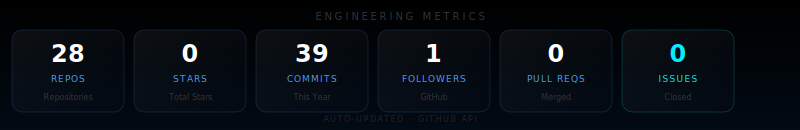

<!-- ═══════════════════════════════════════════════════════════════════ -->
<!--  ADEMOLA BADRU — GitHub Profile README                            -->
<!--  github.com/Xconmax245                                            -->
<!-- ═══════════════════════════════════════════════════════════════════ -->

<div align="center">
  
</div>

<div align="center">
  
</div>

<br/>

<div align="center">

[](https://xconmax245.dev)
&nbsp;
[](https://linkedin.com/in/ademola-badru)
&nbsp;
[](https://twitter.com/Xconmax245)
&nbsp;
[](mailto:mail@xconmax245.dev)

</div>

<br/>

---

<br/>

## Engineering Philosophy

> I enjoy building systems that remain simple under complexity.
>
> My focus is scalable architecture, maintainable codebases, and developer experience — not just shipping features.
> The best code is code that the next engineer can confidently extend, debug, and own.

<br/>

---

<br/>

## Design Principles

| # | Principle | Approach |
|---|---|---|
| **01** | Performance First | Measure before optimizing. Profile in production, not in theory. |
| **02** | Minimal Dependencies | Own the critical path. Every dependency is a liability. |
| **03** | Security by Default | Threat model from day one, not as an afterthought. |
| **04** | Maintainability Over Cleverness | Write code for the next engineer, not for the compiler. |
| **05** | Developer Experience Matters | APIs should feel obvious. If you need a long README to explain it, redesign it. |

<br/>

---

<br/>

## Engineering Roadmap

```
Shipping     ──────────────────────────────────────────────────────────
             Proxy Protocol
             Production decentralized wallet infrastructure
             Custody-free · High-availability · Multi-chain

Building     ──────────────────────────────────────────────────────────
             Developer Tooling
             Automation, open-source utilities, and CLI infrastructure
             Built for engineers, by an engineer

Researching  ──────────────────────────────────────────────────────────
             Distributed Systems
             Consensus algorithms · Fault-tolerant architecture
             Byzantine fault tolerance · CRDT data structures
```

<br/>

---

<br/>

## Architecture Timeline

<div align="center">
  
</div>

<br/>

---

<br/>

## Live Stack Architecture

<div align="center">
  
</div>

<br/>

---

<br/>

## Featured Projects

<div align="center">

<table>
<tr>
<td width="33%" align="center">



**[Proxy Protocol](https://github.com/Xconmax245)**

Production decentralized wallet infrastructure. Custody-free architecture with multi-chain support, high availability, and encrypted key delegation.


</td>
<td width="33%" align="center">



**[Developer Tools](https://github.com/Xconmax245)**

Open-source CLI utilities and automation modules. Zero-dependency where possible, composable by design, tested in production.


</td>
<td width="33%" align="center">



**[Consensus Lab](https://github.com/Xconmax245)**

Research into distributed consensus, Byzantine fault tolerance, and conflict-free replicated data types. Experimental, open-ended, ongoing.


</td>
</tr>
</table>

</div>

<br/>

---

<br/>

## Repository Highlights

> Real-time stats for the flagship repository — updated automatically.

<div align="center">

[](https://github.com/Xconmax245)
&nbsp;
[](https://github.com/Xconmax245)

</div>

<br/>

---

<br/>

## Tech Stack

**Languages**


**Frameworks & Runtime**


**Infrastructure & Data**


<br/>

---

<br/>

## Metrics

<div align="center">
  
</div>

<br/>

<div align="center">
  
</div>

<br/>

---

<br/>

## Activity

<div align="center">
  
</div>

<br/>

---

<br/>

## Contribution Snake

<div align="center">
  
</div>

<br/>

---

<br/>

## Connect

<div align="center">

If you're working on something ambitious in infrastructure, Web3, or developer tooling — I'm interested.

<br/>

[](https://xconmax245.dev)
&nbsp;
[](https://linkedin.com/in/ademola-badru)
&nbsp;
[](https://twitter.com/Xconmax245)
&nbsp;
[](mailto:mail@xconmax245.dev)

</div>

<br/>

---

<div align="center">
  
</div>

<!-- last-refreshed: 2026-07-19T05:47:26Z -->
<!-- ═══════════════════════════════════════════════════════════════════ -->
<!--  Built with precision. Maintained with intent.                    -->
<!--  © 2026 Ademola Badru                                             -->
<!-- ═══════════════════════════════════════════════════════════════════ -->
